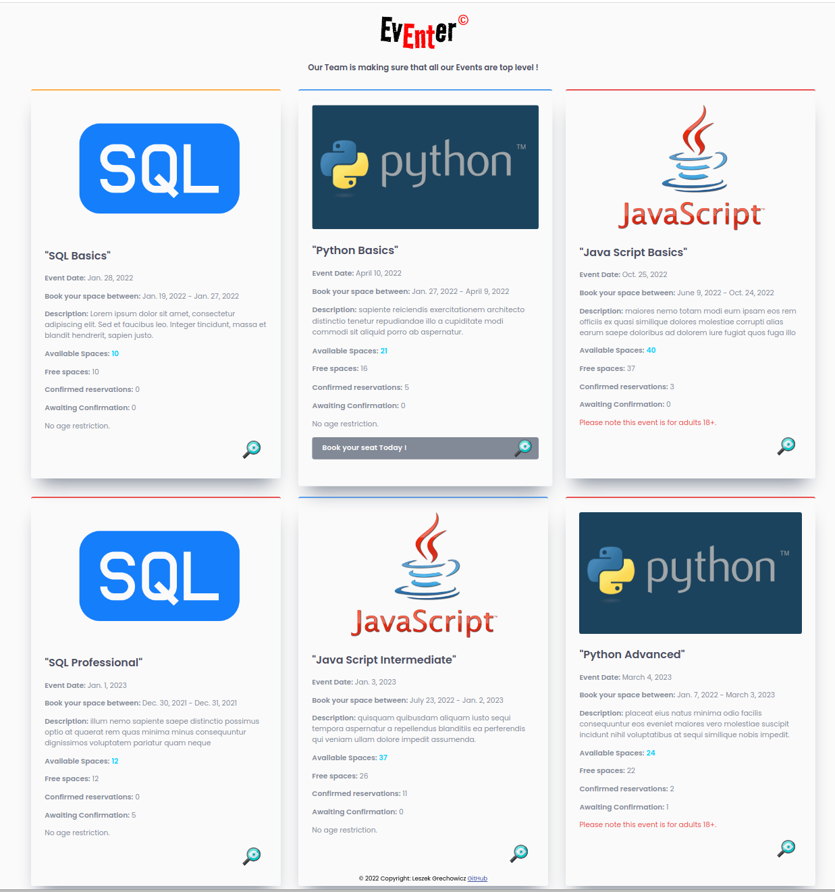

# "Event_Booker - Eventer"
Django based event booking system

 

## Preparation:

Python Installation is required !

- Crate new folder and new working environment using python/pip.
- Install requirements.txt using pip.
- Run script `create_db_postgre.py` to crate `event_booker` database under PostgreSQL
  
- Crate python script passwords.py in /config directory and add the below code:
  
        DJ_SECRET_KEY = <your django secret key goes here>
        DB_USERNAME = <DB user name goes here>
        DB_PASSWORD = <DB password goes here>

- Run Django command `python3 manage.py makemigrations ` to make/prepare migrations
- Run Django command `python3 manage.py migrate ` to implement migrations
- Run Django command `python3 manage.py populate_events` to load initial database data
- Run Django command `python3 manage.py test` to make sure everything is working correctly
- Lastly run App using `python3 manage.py runserver` 

Enjoy !
